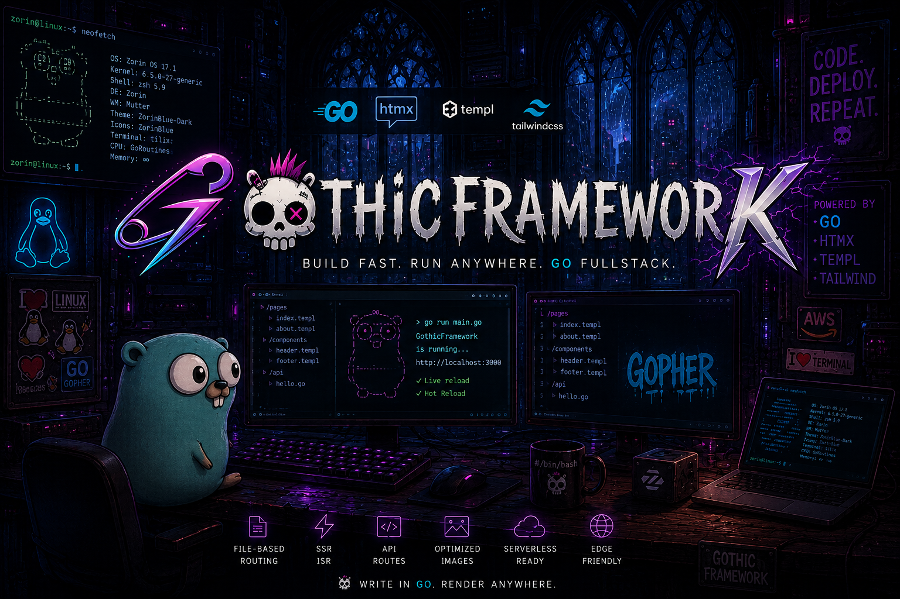

[](https://github.com/gothicframework/core/actions/workflows/ci.yml)
[](https://codecov.io/gh/gothicframework/core)

# Gothic Framework — Core (runtime library)

**Gothic Framework** is a developer-first toolset for building fast, scalable, modern web apps in Go with the **GOTTH stack** — **Go**, **TailwindCSS**, **Templ**, and **HTMX**.

This module (`github.com/gothicframework/core`) is the **runtime library** a Gothic app imports: file-based routing, the caching/ISR layer, the client-side WASM runtime, and the framework's HTTP assets. It has **no CLI and no cloud/deploy dependencies** — a project importing `core` never pulls in Docker or the AWS SDK.

> You don't add `core` to a project by hand. Install the **[`gothic` CLI](https://github.com/gothicframework/cli)** and run `gothic init` — it scaffolds a project that imports `core` (plus [`components`](https://github.com/gothicframework/components) and [`middlewares`](https://github.com/gothicframework/middlewares)) at the right versions.
>
> ```bash
> go install github.com/gothicframework/cli/v3/cmd/gothic@latest
> gothic init github.com/you/my-app
> ```

---

## What's inside

| Package | Import path | Role |
|---|---|---|
| `config` | `github.com/gothicframework/core/config` | The `gothic.config.go` schema: `Config`, `DeployConfig`, `RuntimeConfig`, the ENV builders (`Env`/`SSMParam`/`SecretsManager`), and the deploy `Provider` enum. |
| `router` | `github.com/gothicframework/core/router` | File-based routing, `RouteConfig[T]` / `ApiRouteConfig`, and the cache backends (in-memory / Redis / local-files) that power static caching + ISR. |
| `wasm` | `github.com/gothicframework/core/wasm` | The client-side state runtime — `ClientSideState`, observables, topics, durable cache — compiled per-component to TinyGo WASM, plus the static full-Go core. The static core also embeds the Go/WASM htmx runtime ([`htmx-go`](https://github.com/gothicframework/htmx-go)), which installs `window.htmx` on boot, so `gothic-core.wasm` provides the page's htmx client. |
| `runtimeassets` | `github.com/gothicframework/core/runtimeassets` | Serves the framework's browser runtime from an embed under `/_gothic/*` — the five assets `gothic-core.js`, `gothic-core.wasm`, `gothic-core-exec.js`, `gothic-core-boot.js`, and `wasm_exec.js` (precompressed brotli+gzip, content-negotiated). |
| `render` | `github.com/gothicframework/core/render` | Templ render cache + logger used by the router. |
| `gothiccore` · `corewasm` · `wasmexec` | `…/core/{gothiccore,corewasm,wasmexec}` | The embedded browser assets (`gothic-core.js`, the prebuilt `core.wasm`, and the TinyGo `wasm_exec.js`), each content-hash versioned for cache-busting. |

The reusable UI components and the runtime middleware live in the companion modules, so the pieces you write into pages come from there:

- **[`components`](https://github.com/gothicframework/components)** — `RuntimeScripts`, `Styles`, `StatefulComponentOf`, `OptimizedImage`.
- **[`middlewares`](https://github.com/gothicframework/middlewares)** — `middlewares.Middleware`, the single chi middleware that wires the whole runtime.

---

## How a Gothic app uses it

A scaffolded project mounts the entire runtime as one chi middleware and pulls the runtime scripts/styles into its layout — the framework's built-in routes (`/_gothic/*`, `/public/*`, `/optimizedImage/*`) all come from that:

```go
// main.go
router := chi.NewMux()
router.Use(middlewares.Middleware(Config.Runtime)) // the entire Gothic runtime
routes.RegisterFileBasedRoutes(router)             // your file-based pages
```

```go
// layout.templ — in <head>
@gothicComponents.Styles()
@gothicComponents.RuntimeScripts()
```

Configuration is a type-safe `gothic.config.go` that imports `core/config`. See the **[CLI README](https://github.com/gothicframework/cli)** for the full config schema, the `gothic` command reference, and deploys.

---

## Design docs

- [`docs/DESIGN-INSPIRATIONS.md`](docs/DESIGN-INSPIRATIONS.md) — prior art that shaped the v3 design, and what we deliberately did *not* adopt.
- [`docs/adr/`](docs/adr/) — Architecture Decision Records (custom codec, schema seam, two-tier protocol, static full-Go core).
- [`RELEASE_NOTES_v3.md`](RELEASE_NOTES_v3.md) — the v3.0.0 breaking-change and feature notes.
